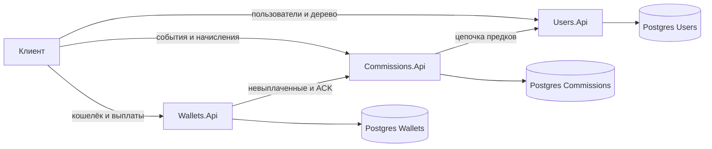

# Система партнерских отчислений

Три независимых HTTP-сервиса на .NET 10, у каждого свой Postgres. Cервисы оьщаются по HTTP, исходящие вызовы фиксируются в Outbox и дожимаются retry. Общей БД и распределённых транзакций нет — согласованность через локальный commit и идемпотентные ключи.

Локально всё поднимает `docker compose`: сначала все БД, затем миграция каждого API (`pre_start`), после неё — сами сервисы.

## Взаимодействие



## Запуск

```bash
docker compose up --build
```
